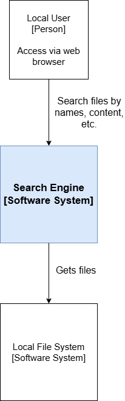

# File-Search-Engine Architecture
A file search engine that indexes the contents of my local system. Enables filtering and real-time search by title, content, metadata, etc.

## System Context
The system interacts with the user via web browser. The data is scraped from the local file system upon application startup.
The overall system context is as follows:

## Containers
The overall system is comprised of several containers:

### Web Application Container (Front End)
The front-end container is the Web Application Container. The user accesses it via the browser. The web app uses **Angular** (and **Angular Material**).

### API Container
The API container is responsible for providing the requested data to the front-end. 
The connection between the API and the web app will be made through **WebSockets**, to enable real-time search. The API uses **C++** with [uWebSockets](https://github.com/uNetworking/uWebSockets) to ensure a smooth data flow.

### Database Container
The Database will use PostgreSQL to manage the persisted data. The core feature of the application is a very fast real-time search function. PostgreSQL is very well suited for this task thanks to its integrated full text search feature.

### Index Builder Container
The Index Builder is responsible for scraping the file tree and uploading it to the database. The initial design will parse the file system upon the application's startup and update the database accordingly.
*Potentially, a cronjob approach will be implemented in future versions to detect updates that occur while the app is running*.

## Classes
The class structure is outlined in the following diagram:

The general idea is as follows:
* The API will feature a classic layered architecture, split into Controller, Service, and Data classes. The communication will be made with DTO objects.
* The Index Builder will be a separate logical component from the layers of the API and will be called upon startup.
